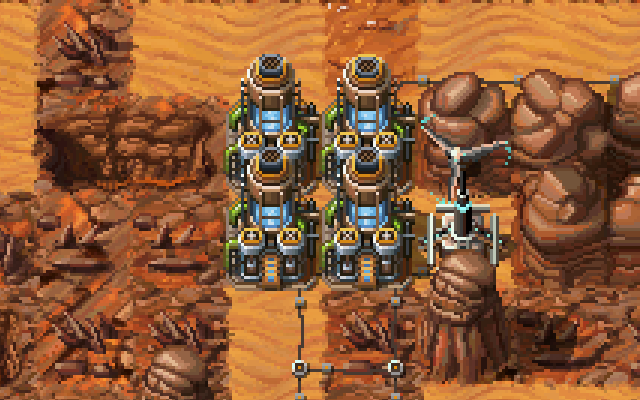

## Water pumps

A water pump next to another water pump yields 38 water/turn instead of 32/turn, and if it has two pumps next to it, that'll be 42/turn.

So a set of 3 pumps generates 22 extra water/turn, and a square of 4 generates extra 40 water/turn, which is better than having 5 lonely pumps.

In other words, if you don't need a water terraform for farming, creating a second tile of water next to an existing pump can be a good investment.

## Condensers
A reasonable way to cover a slight water deficit, but don't get too excited - it takes *a lot* of glass and space to replace a water pump this way.

## Water tanks
As each citizen consumes 1 water/turn and you might add up to 30 of them at once, it's a good idea to eventually add a few tanks so that you don't risk running out of water in a few turns if you forget about water supply before accepting a new batch.