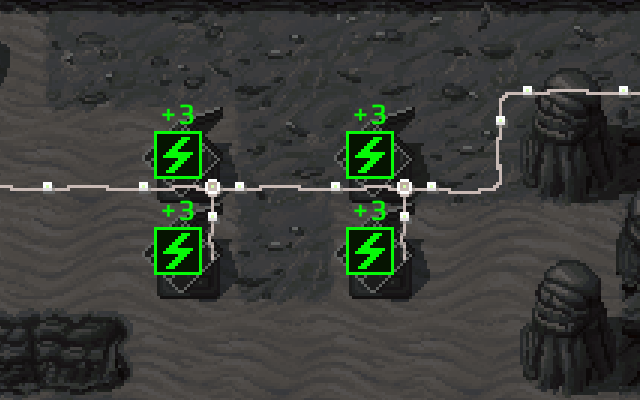
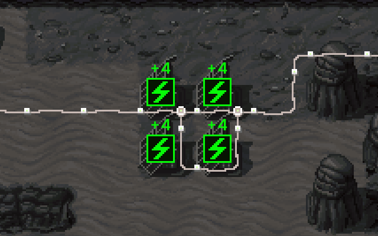
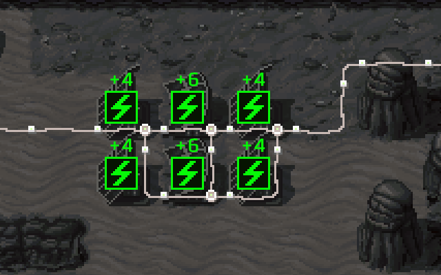
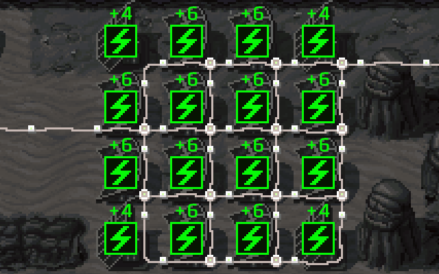

## Wind turbines
A wind turbine is sort of like a condenser in the power generation category - you can make power this way, but it sure is expensive.

Still, tucking a few of these next to 2 or 3 cliffs is a good way to generate a bit of extra power if you're short on glass.

## Solar panels
This is where things get interesting: solar panel is both the cheapest building with adjacency bonus and the one that gets the most out of it.

A solar panel gets +1 power/turn for having 2 neighbors and +3 power/turn for having ≥3 neighbors.

Suppose you have 4 solar panels. That's 3x4 ➜ 12 power/turn.

If the panels were to stand in a square, they'd generate 4x4 ➜ 16 power/turn (+33%).

Adding more panels in a rectangular shape causes the middle ones to have ≥3 neighbors and generate twice the power.

An arbitrarily large formation of panels generates (width x height x 6 - 8) power/turn, so the more you have, the closer you are to getting twice the output (at 4x4, that's +83%)

## Geothermal generator
Space-efficient and fairly expensive. Often better than placing another dozen solar panels if you can spare the resources.

## Capacitors
Good to have a couple of these so that you don't have to worry about timely placing more solar panels whenever you accept a new batch of colonists or add a new building.