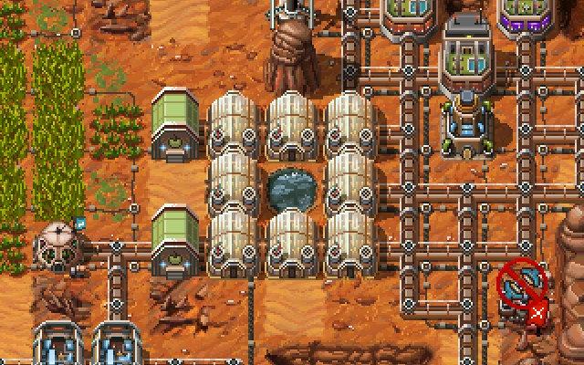
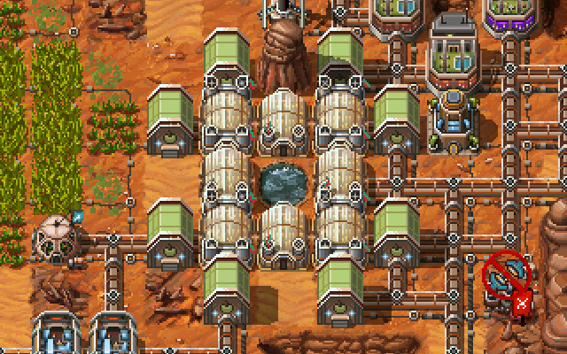
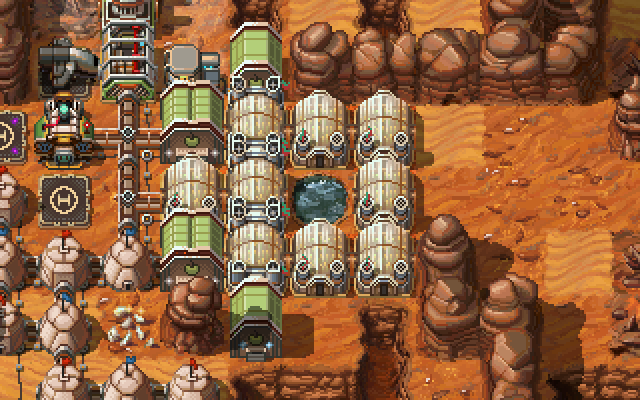
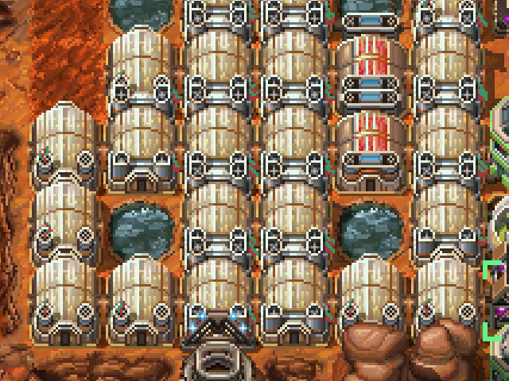

A greenhouse gets +1 food/turn if it has 2 neighbors and +2 food/turn if it has ≥3. Food silos count as half. Parks and spice greenhouses are equivalent to greenhouses for level calculation.

Per earlier, optimizing greenhouses is perhaps the most important for freeing up workers and creating a surplus that you can trade.

You might have already noticed that creating a ring of greenhouses is a good way to bump each of them to +1 food/turn, which already helps a bunch:  

If you have some spare soil tiles around there, you can add pairs of food silos next to the corner greenhouses, which will bump them to level 3 / +2 food/turn:  

In case of temporary shortages you can also add a ground hydrator between a pair of greenhouses and put a greenhouse on it, which will bump it to level 2 and bump the greenhouse next to it to level 3:  

But you know what's better? Stacking multiple greenhouse rings next to each other, which will bump all of the "middle" tiles to level 3:  

Using game-issued water terraforms to expand a greenhouse complex can have a big payoff.