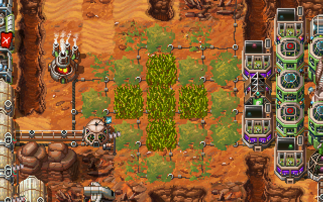
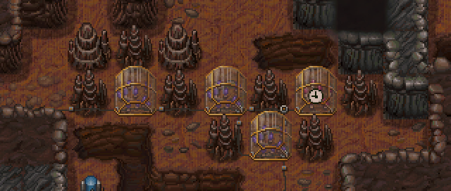

## Bacteria / Moss / Grass
If you have a relatively flat area that you do not intend to build houses on, you can make a bit of money by planting Bacteria.

A Bacteria tile with 4 Bacteria neighbors (or 2 moss/house/etc. neighbors) can level up and be replaced with a Moss tile, which brings more money.

A Moss tile with 3 Moss/house/etc. neighbors can level up and be replaced with a Grass tile. A grass tile brings even more money, but also it consumes spice each turn, so consider whether that's worth the trouble.  

 
## Fungi
Underground, you can plant fungi instead of bacteria.

Fungi cannot be "upgraded" like bacteria, but a fungi tile with 3 stalagmite/house neighbors will produce 1 spice/turn, which is a good way to cover needs of a park or create a bit of a surplus for export without sacrificing a greenhouse.

Dump terraforms are generally cheap enough that you can find a tile with a pair of adjacent stalagmites and add a third one. Or plant two extra fungi tiles if you prefer.  
