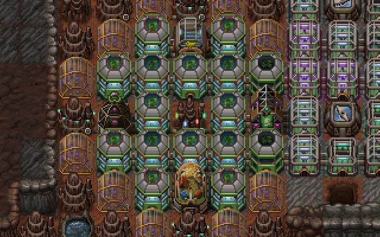

## House
A house offers living space for 5 colonists.
If it has 2 neighbors (other houses/luxury houses or most recreational buildings), it'll house 7 colonists.
And if it's surrounded by appropriate buildings from all sides, it'll house 9.

## Luxury house
A luxury house is similar to a house, but with a few differences - it costs a bunch more, it can sit on sand, and instead of housing more people higher levels (gained by having 1..3 desirable tiles next to it) grant +1..+3 morale.

In other words, a luxury house standing next to 3 canyons is as good as a house with a park and a pool nearby. Amusing, but very useful - we'll get to this shortly.

## "City blocks"

Consequence of the Morale section, it's a good idea to keep all of your houses within area-of-effect of positive-effect buildings.

The primary 4 of these (community center, restaurant, park, pool) all have a 2-block-wide circular area that can be shifted around, so you can tuck all of the houses and recreational buildings in there. I'll call these a "city block":  

Each "block" can house 137 citizens or so, has +6 morale bonus, and can be placed next to other "blocks".  

A simple design has a few issues, however - the houses at the outer edge can't reach level 3 because they only have 2-3 neighbors instead of 4 and eventually the morale bonus will come down to +2 because of colony size penalty.

But what if we replaced outer-edge houses with luxury houses instead? That's only 1 person less per house, and we can get +1 or +2 morale for them if we place tiles of interest (or just dig up a canyon or two) nearby:  
  
This brings us to 129 citizens per block and +6.3 .. +6.7 average morale bonus.

The situation can be further improved by placing the 4 recreational buildings at the middle of each side and eventually replacing the middle house with a statue:  
  
That brings us to precisely 120 citizens per block and +7.4 average morale bonus, which means that you can have a thousand-citizen city with morale of +3.4.

If you can afford to sufficiently flatten an area, you may also build city blocks surrounded by moss or even grass:  
  
(a good balance is one tile of moss/grass between city blocks)

And finally, if you want to get ridiculous, you can build this kind of setup with luxury houses for a morale bonus of +8:  
  
Apart of looking like an interesting place to live (you can stare into the [strike]abyss[/strike] canyon *or* touch grass), this isn't very practical - as of writing this guide the game's yet to encourage you to get this much morale for anything.

## Underground
Building a city underground is a complicated process that can involve a lot of terraforming to produce bedrock tiles for houses to stand on, so I would generally recommend to hold it off until you're done with mission objectives.

But if you'd really like, an underground city block might look like this (sans the right side):  
