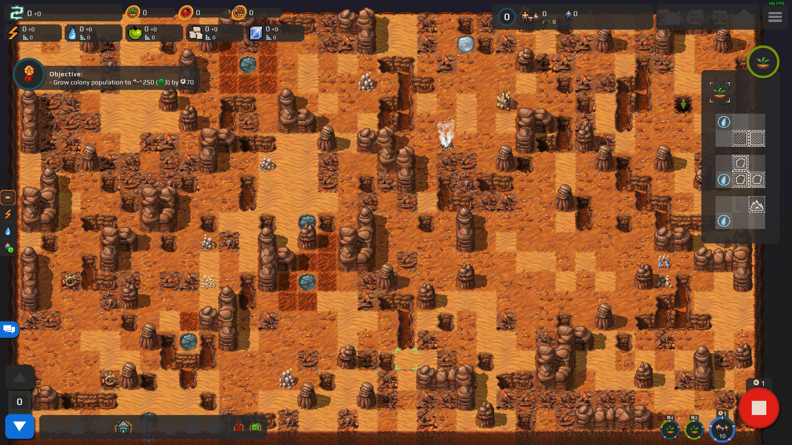
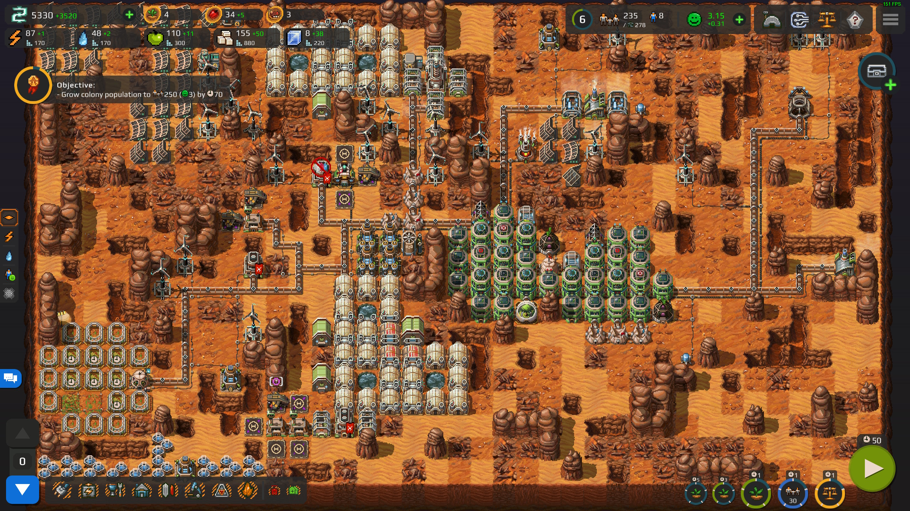
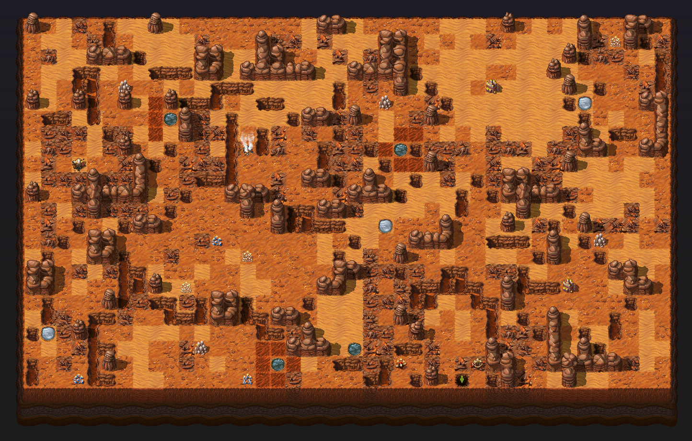

Most of the achievements are extremely self-descriptive and you'll most likely get them while completing the campaign normally so I'll only go over the ones that aren't trivial.

And remember that you don't have to do this during a mission - you can complete a mission normally and then mess with achievement goals without a time limit.

## Lesson Learned  
For how hard this game might seem at times, it's pretty hard to reach the lose-state - you'll need to get your population to 30, get every loan that you can get, spend all of that money on the shop, lose colonists due to insufficient food/water, and only then you can go bankrupt due to having balance of -1500 or so.

## SURPRISE!  
Awarded for finding a research-able object tile under a rock without having scanned it first. Pretty sure that it's statistically unlikely that you don't have this achievement upon completing the campaign, but if that is so, you can memorize which surface rock had the thing and re-play a mission with the same seed (shown on pause menu)

## Forgive Me, For I Have Sinned  
Restart the same map 10 times on first turn (from the pause menu).

## Li'l Finland  
Getting 5 stars in Free Play 2 means getting this achievement and maintaining a high-morale settlement generally isn't very hard if you keep the advice from the Housing section in mind.

## Capital City and MEGACITY!  
I recommend doing these somewhere with a lot of space, such as the last campaign mission - as your city grows bigger, electricity becomes the primary problem and more and more space on the surface gets taken up by solar panels.

## Hey, It's Kind of Nice Down Here!  
I also recommend doing this on the last campaign mission - either properly (see Housing) or as a rather-mediocre bunch of houses that you force people into for a few turns by turning off the surface houses.

## Flat Mars and Left Bank of Kyiv  
I recommend doing these on a small map, such as Free Play 1.

## True Legend  
Remember that you can re-play a mission with the same seed and all of the terraforms/underground layer layouts will be the same, but if there's still trouble, here are my notes and seeds:

### Free Play 1  
At least to me, this mission seemed very mild after the campaign - it's a little map with a few underground layers.

### Free Play 2  
raDgKKaQ5c8b2mXG  
  
This seed is kind of nuts - to the left of center of the map you have what seems to be 3 landing zones merged together - 3 ore deposits, 3 water tiles (with 6 accessible soil tiles around one of them), and a fourth spot behind a single mountain.

I expanded north and built greenhouses there first, then added a third factory and started building a city block on the right, later expanding downwards to add more greenhouses there.  

### Free Play 3  
I have completed this mission on seed J3HMEmWvLqRoatte because it has a large empty space above the bottom area (and, as it turned out, Hydrologist among the first set of specialists), though there are definitely better seeds in terms of resource access.  

The things to keep in mind on this mission are:
-  You can "storm-proof" your greenhouses by adding artificial lighting to them (which will not consume power when there's sunlight) - just make sure that you have enough stored power to sustain the stress for a few turns.  
-  You can get [spoiler]superquarks[/spoiler], but you can't stop the dust storm, so there's only so much to search for underground.
